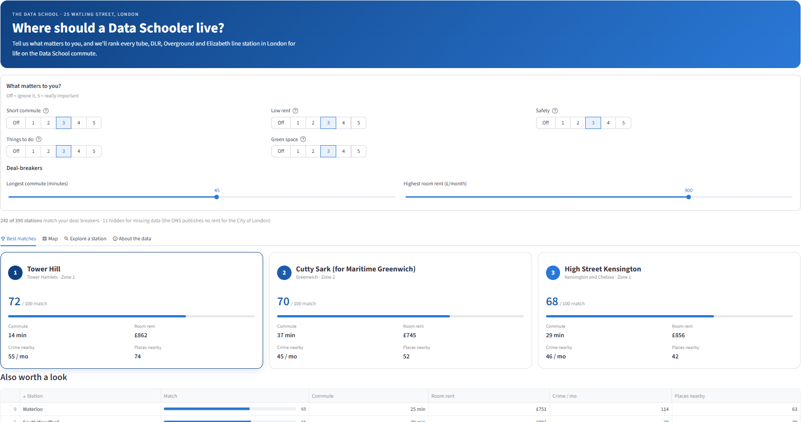

# Where should a Data Schooler live?

**[Try the live app →](https://where-should-a-data-schooler-live.streamlit.app/)**

[](https://github.com/tysgreen/where-should-a-data-schooler-live/actions/workflows/ci.yml)

An app that ranks every London tube, DLR, Overground and Elizabeth line station as a place to live while training at the Data School (25 Watling Street, EC4M 9BR). It scores **commute, rent, safety, things to do and green space**, and you choose how much each one matters.

It's built on a small but complete data pipeline: **6 free data sources → Python extract → DuckDB SQL layers → tested → Streamlit app**, refreshed automatically every month.



---

## What I built and who it's for

Anyone joining the Data School in London faces the same question: *where do I live?* Letting agents will tell you an area is "well connected". This app answers with data instead:

- **How long is the commute to Watling Street?** Door to desk, arriving 9am on a weekday, from TfL's own journey planner.
- **What does a room cost?** Most Data Schoolers will share a flat, so the app uses the median rent for a *room in a shared home* in the station's borough (ONS), with the whole-flat 1-bed average alongside.
- **Is it safe?** Street-level crimes against people within 500m, from police.uk.
- **Is there anything to do?** Pubs, cafés, gyms, supermarkets and parks within 500m, from OpenStreetMap.

Rate how much each theme matters to you (off to 5), set your deal-breakers (longest commute, highest room rent), and all 390 stations are re-ranked instantly: your best three matches, a map, and a detailed card for any station.

## The data

| Source | What I use | Access | Quirks I had to handle |
|---|---|---|---|
| [TfL Unified API](https://api-portal.tfl.gov.uk) (StopPoint) | Every station on 4 networks | Free key | Returns platforms, entrances and access areas too (2,691 records for 420 stations). Stations on several networks appear several times with different IDs but a shared "hub" code. Names carry suffixes ("Acton Town Underground Station"). Zones come as `2`, `2/3` or `2+3`. |
| [TfL Unified API](https://api-portal.tfl.gov.uk) (Journey) | Fastest route from each station to the office | Free key | One request per station (420). Occasionally returns 404 from exact coordinates (Camden Town), so the script retries with the station's ID. |
| [postcodes.io](https://postcodes.io) | Office coordinates, and each station's borough | No key | Up to 100 lookups per request. |
| [police.uk](https://data.police.uk/docs/) | Street-level crime within 500m, last 3 months (184,767 records) | No key | Published ~2 months late. Searches by polygon, so the script builds a 16-sided "circle" around each station. Locations are anonymised to nearby street points. |
| [OpenStreetMap Overpass](https://wiki.openstreetmap.org/wiki/Overpass_API) | 15,538 pubs, cafés, gyms, supermarkets and parks in Greater London | No key | Parks are shapes, not points, so I ask for each shape's centre. |
| [ONS Private rental market in London](https://www.ons.gov.uk/economy/inflationandpriceindices/adhocs/3389privaterentalmarketinlondonapril2025tomarch2026) | Median rent for a **room** in a shared home, by borough (Apr 2025–Mar 2026) | Download | An occasional ad hoc release, so its link lives in `config.py`. Figures from fewer than 5 rents are hidden as `..`. Some boroughs rest on only ~10 recorded room rents. |
| [ONS Price Index of Private Rents](https://www.ons.gov.uk/economy/inflationandpriceindices/datasets/priceindexofprivaterentsukmonthlypricestatistics) | Average whole-flat 1-bed rent by borough, latest month (shown for comparison) | Download | Not an API: the file's URL changes monthly, so the script reads the dataset page and follows the newest link. Missing values are written as `[x]`. |

All sources are free and published under open licences (Open Government Licence / ODbL).

## How it works

```
extract/            1. EXTRACT  Python scripts call each API and save the responses untouched
   run_extract.py       -> data/raw/  (gzipped JSON, not committed: ~36 MB, recreated by running the scripts)
sql/
   01_raw.sql       2. RAW      load the JSON into DuckDB, one row per record
   02_staging.sql   3. STAGING  pick fields, fix types, clean names, remove duplicates
   03_marts.sql     4. MARTS    join everything into one scored row per station
pipeline/
   run_models.py        runs the three SQL files in order -> data/where_to_live.duckdb
                        and exports the final table -> data/marts/stations.parquet (committed, 35 KB)
tests/              5. TEST     unit tests + data quality checks on the final table
app/app.py          6. APP      Streamlit reads stations.parquet
```

**Extract.** Each script handles one source and saves every response wrapped with *when* it was fetched and *what was asked for*, so any number in the app can be traced back to the request that produced it (the TfL key is never saved). A shared helper retries automatically on rate limits and server errors, waiting longer each time (1s, 2s, 4s…). Files are written to a temporary name and renamed only once complete, so a crash never leaves a half-written file.

**Incremental loading.** Re-running the extract skips anything already saved: commutes per station, crime per month. If the run is interrupted halfway through, just start it again. On the monthly refresh, only the newest month of crime data needs downloading.

**Raw → staging → marts.** The same three-layer pattern data teams use in dbt:
- **raw** keeps the JSON exactly as received, so nothing is lost if I later need another field.
- **staging** is where the cleaning happens, one table per concept (stations, commutes, crimes, amenities, rents), each with the quirks above fixed and explained in comments.
- **marts** answers the question. It counts amenities within 500m of each station by pairing every station with every amenity (≈6 million pairs, under a second in DuckDB) and measuring the distance with the haversine formula, a SQL macro. It then joins everything and turns each theme into a 0-100 score with `percent_rank()`, so 100 means best in London.

The database is rebuilt from scratch every run, so the same raw files always give the same result.

**Scoring choices** (the judgement calls, made explicit):
- **Safety** counts *crimes against people* (violence, robbery, theft from the person, burglary, weapons). Shoplifting mostly measures how many shops there are, so it's left out of the score.
- **Rent** uses the median price of a **room in a shared home**, because that's what most people rent, not a whole flat. It's by borough, so it's coarse (every station in Hackney gets the same figure), and small boroughs rest on few rents. The app shows each figure's sample size. The ONS also breaks rooms down by postcode district, but about three-quarters of those figures are suppressed for small samples, so borough is the most reliable level.
- **Stations outside Greater London** (e.g. Reading, Watford Junction on the Elizabeth line and Overground) are excluded.
- **Missing data isn't guessed.** The ONS publishes no room or flat rents for the City of London, so those stations are hidden whenever "Low rent" matters to you, and the app says so.

**Tests.** `pytest` checks the extract helpers (e.g. that the crime search polygon really is 500m from the station) and the final table: one row per station, unique clean names, all inside London, realistic commute times and rents, a room always cheaper than a whole flat, scores between 0 and 100, and rent missing *only* where expected. They run on every push (`.github/workflows/ci.yml`).

**Monthly refresh.** `.github/workflows/refresh.yml` runs on the 3rd of each month: extract → build → test → commit the new `stations.parquet`. Because it commits only if the tests pass, bad data never reaches the app. Raw files are cached between runs to keep it incremental.

## How to run it

Needs Python 3.10+ and a free TfL key ([api-portal.tfl.gov.uk](https://api-portal.tfl.gov.uk) → subscribe to "500 Requests per min").

```bash
git clone https://github.com/tysgreen/where-should-a-data-schooler-live.git
cd where-should-a-data-schooler-live
python -m venv .venv
source .venv/bin/activate          # Windows: .venv\Scripts\activate
pip install -r requirements.txt
cp .env.example .env               # then paste your TfL key into .env

python extract/run_extract.py      # ~35 min the first time (mostly 1,260 crime requests + 420 journeys)
python pipeline/run_models.py      # ~10 s
pytest                             # data quality checks
streamlit run app/app.py
```

To just look at the app, skip the first two steps: the latest `stations.parquet` is already in the repo.

Settings (office postcode, 500m radius, networks, months of crime) live in `config.py`.

## What I would do next

- **Finer rent data.** Borough averages hide big differences (Stratford vs Forest Gate). Listing-level data would help, but there's no open source.
- **Commute reliability.** Add TfL line status history, so a 25-minute commute that's often disrupted scores lower than a steady 30.
- **Night life and night travel.** Score how easy it is to get home after a Thursday social.
- **Test the pipeline on fixtures in CI.** Save a small sample of raw responses so CI can run the SQL end to end, not only check the final table.

## Where AI helped

I used Claude (Anthropic) as a pair programmer throughout. I chose the direction at every step, ran everything against the real APIs, and reviewed all the code.

| Stage | What Claude did | What I did |
|---|---|---|
| Choosing the idea | Researched ~25 free APIs, checking access, terms and rate limits | Rejected ideas that felt boring; picked this one |
| Testing an idea first | Wrote a feasibility check for an earlier "meal deal optimiser" idea | Ran it; it showed the data was too patchy, so I dropped that idea |
| Design | Proposed stations as the unit and the five sources | Chose the unit, the output and the office location |
| Code | Drafted the extract scripts, SQL, tests and app | Ran them on real data, reviewed them, and decided the scoring rules |
| Debugging | Diagnosed issues from real data (see below) | Reproduced them and approved the fixes |

Problems found along the way, and how they were fixed:
- The first raw crime load ran out of memory. DuckDB was copying each whole JSON line onto every crime row. It was fixed by extracting the small fields before unnesting (see comments in `sql/01_raw.sql`).
- `->` means both "JSON field" and "lambda" in DuckDB SQL, which caused confusing errors. Fixed by using the explicit `lambda x:` syntax.
- A helper file named `http.py` would have broken Python's own `http` module. It was renamed.
- Tube and Overground Bethnal Green are different stations with the same name. The final table adds the network to tell them apart.
